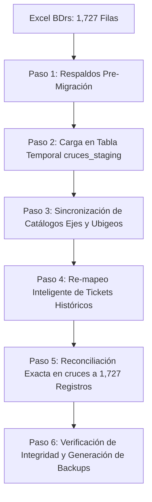

# Procedimiento de Migración y Reconciliación de Cruces Semafóricos

## 1. Resumen Ejecutivo

Este documento detalla el procedimiento técnico ejecutado para migrar, depurar y reconciliar la lista maestra de intersecciones semafóricas y bases operativas de Lima Metropolitana a partir del archivo Excel oficial [`backups/cruces-complete.xlsx`](file:///f:/Projects/monitoreo-apirest/backups/cruces-complete.xlsx) (hoja `BDrs`), preservando al 100% la integridad referencial de los **62,856 tickets de incidencias** del sistema.

### Resultado Final en Base de Datos:
* **Total de Registros en `cruces`**: **`1,727`**
  * **Cruces Semafóricos en Vía Pública (`C%`)**: **`1,725`**
  * **Bases Operativas (`B%`)**: **`2`** (`B01001` - Base Cuzco y `B28001` - Base Acho).
* **Tickets Históricos Preservados**: **`62,856`** (100%).
* **Tickets Huérfanos**: **`0`** (0.00%).
* **Ejes Viales en Catálogo (`ejes`)**: **`2,437`** (628 nuevas vías incorporadas).

---

## 2. Estándar de Codificación (`CXXYYY` / `BXXYYY`)

La codificación de infraestructura sigue la siguiente nomenclatura:

$$\text{[Prefijo]} + \text{[XX: Código Distrito]} + \text{[YYY: Correlativo]}$$

### Desglose de Componentes:
1. **Prefijo**:
   * **`C`**: Cruce semafórico en vía pública.
   * **`B`**: Base operativa / centro de control.
2. **`XX` (Dígitos del Distrito según Ubigeo `1501XX`)**:
   Corresponde a los dígitos 5 y 6 del código Ubigeo oficial de Lima Metropolitana:
   * `01`: Lima / Cercado de Lima (ej. `B01001` Base Cuzco, `C01001` a `C01265`)
   * `03`: Ate (`C03001` a `C03082`)
   * `06`: Carabayllo (`C06001` a `C06019`)
   * `07`: Chaclacayo (`C07001` a `C07014`)
   * `08`: Chorrillos (`C08001` a `C08064`)
   * `10`: Comas (`C10001` a `C10065`)
   * `14`: La Molina (`C14001` a `C14047`)
   * `15`: La Victoria (`C15001` a `C15094`)
   * `18`: Lurigancho / Chosica (`C18001` a `C18036`)
   * `22`: Miraflores (`C22001` a `C22049`)
   * `28`: Rímac (`B28001` Base Acho, `C28001` a `C28036`)
   * `31`: San Isidro (`C31001` a `C31061`)
   * `32`: San Juan de Lurigancho (`C32001` a `C32094`)
   * `35`: San Martín de Porres (`C35001` a `C35067`)
   * `40`: Santiago de Surco (`C40001` a `C40112`)
   * `42`: Villa El Salvador (`C42001` a `C42040`)
   * `43`: Villa María del Triunfo (`C43001` a `C43026`)
3. **`YYY` (Correlativo Secuencial)**:
   Número de 3 dígitos (`001`, `002`, `010`, `100`...) que enumera de manera secuencial los cruces dentro de cada distrito `XX`.

---

## 3. Flujo Paso a Paso de la Migración



### **Paso 1: Respaldos Preventivos (Zero Data Loss)**
Se generaron tablas de respaldo dentro del motor PostgreSQL antes de cualquier mutación:
```sql
CREATE TABLE cruces_backup_20261005 AS SELECT * FROM cruces;
CREATE TABLE tickets_backup_20261005 AS SELECT * FROM tickets;
CREATE TABLE ejes_backup_20261005 AS SELECT * FROM ejes;
```

### **Paso 2: Tabla de Auditoría Temporal (`cruces_staging`)**
Se creó la tabla `cruces_staging` para procesar y clasificar los 1,727 registros del Excel:
* **`VERIFICADO_EXCEL`** (1,295 registros): Cruces con `verificado = 'C'` que mantuvieron su código manual oficial.
* **`RECUPERADO_BD`** (222 registros): Cruces sin verificación manual en Excel pero que ya existían en BD con tickets activos; se emparejaron por coincidencia de nombre/código anterior dentro del mismo distrito.
* **`NUEVO_GENERADO`** (208 registros): Cruces sin código en Excel que no existían en BD; se les calculó el siguiente código correlativo libre `CXXYYY` de su distrito.
* **`BASE_OPERATIVA`** (2 registros): `BASE CUZCO` (`B01001`) y `BASE ACHO` (`B28001`).

### **Paso 3: Sincronización de Ejes Viales (`ejes`)**
Para evitar errores de clave foránea en `via1` y `via2`, se normalizaron los nombres de las vías y se insertaron las 628 vías faltantes:
```sql
INSERT INTO ejes (nombre_via, created, modified)
SELECT DISTINCT vs.via, NOW(), NOW()
FROM (
  SELECT DISTINCT trim(upper(via1_nombre)) as via FROM cruces_staging WHERE via1_nombre IS NOT NULL AND via1_nombre != ''
  UNION
  SELECT DISTINCT trim(upper(via2_nombre)) as via FROM cruces_staging WHERE via2_nombre IS NOT NULL AND via2_nombre != ''
) vs
WHERE NOT EXISTS (SELECT 1 FROM ejes e WHERE trim(upper(e.nombre_via)) = vs.via);
```

### **Paso 4: Re-mapeo de Tickets Históricos**
Para no perder ningún ticket de los cruces antiguos o duplicados que no estaban en la lista oficial:
* Se calcularon las correspondencias espaciales y de nombres hacia los cruces oficiales.
* Se asociaron los tickets de `CENTRO DE CONTROL` (`ID 99999`) a `BASE CUZCO` (`B01001`).
* Se ejecutó el re-mapeo:
```sql
UPDATE tickets SET cruce_id = <nuevo_id_oficial> WHERE cruce_id = <antiguo_id>;
```

### **Paso 5: Reconciliación y Depuración Exacta**
Se eliminaron todos los registros que no pertenecían a los 1,727 oficiales y se sincronizó la secuencia:
```sql
DELETE FROM cruces WHERE id NOT IN (SELECT real_db_id FROM cruces_staging);
SELECT setval('cruces_id_seq', (SELECT MAX(id) FROM cruces));
```

---

## 4. Archivos de Respaldo Generados

En la carpeta [`backups/`](file:///f:/Projects/monitoreo-apirest/backups/) se encuentran los siguientes archivos listos para revisión y prueba en otros entornos:

| Archivo | Formato | Tamaño | Descripción |
| :--- | :--- | :--- | :--- |
| **`cruces_oficial_1727.sql`** | SQL Dump | 400 KB | Dump de PostgreSQL (`pg_dump`) de la tabla `cruces` con los 1,727 registros, índices y secuencias. |
| **`cruces_y_ejes_oficial_1727.sql`** | SQL Dump | 544 KB | Dump conjunto de `cruces` y `ejes` (recomendado para restaurar en bases limpias sin errores de FK). |
| **`cruces_oficial_1727.csv`** | CSV (UTF-8) | 321 KB | Export tabular con 15 columnas (código, nombre, vías, distrito, suministro, coordenadas, plataforma) para abrir directamente en Microsoft Excel o LibreOffice. |

---

## 5. Guía de Restauración y Prueba en Entorno de Oficina

### Opción A: Restaurar en Docker (Recomendado)
Para probar la data en el contenedor de base de datos de tu oficina:
```bash
# 1. Copiar el archivo al contenedor o ejecutarlo directamente:
docker exec -i monitoreo-db psql -U transito -d protransito < backups/cruces_y_ejes_oficial_1727.sql
```

### Opción B: Restaurar en PostgreSQL Local / DBeaver / pgAdmin
1. Abre tu cliente SQL favorito conectado a la base de datos de prueba.
2. Ejecuta el script [`backups/cruces_y_ejes_oficial_1727.sql`](file:///f:/Projects/monitoreo-apirest/backups/cruces_y_ejes_oficial_1727.sql).

### Opción C: Validar con Consultas SQL Rápidas
Una vez restaurado, puedes verificar los datos ejecutando:
```sql
-- 1. Total de cruces (debe ser 1727)
SELECT count(*) as total_cruces FROM cruces;

-- 2. Conteo por prefijo (1725 de C y 2 de B)
SELECT 
  substring(codigo from 1 for 1) as prefijo,
  count(*) as total
FROM cruces
GROUP BY 1
ORDER BY 1;

-- 3. Verificación de integridad con tickets (debe ser 0 huérfanos)
SELECT count(*) as tickets_huerfanos 
FROM tickets t 
WHERE NOT EXISTS (SELECT 1 FROM cruces c WHERE c.id = t.cruce_id);
```

---

## 6. Scripts Automatizados Disponibles en el Repositorio

Para futuras actualizaciones o revisiones periódicas con nuevos archivos Excel, se han dejado los siguientes scripts en la carpeta [`scripts/`](file:///f:/Projects/monitoreo-apirest/scripts/):
* **[`analyze_cruces_excel.js`](file:///f:/Projects/monitoreo-apirest/scripts/analyze_cruces_excel.js)**: Analiza y compara cualquier archivo Excel contra la base de datos activa.
* **[`populate_cruces_staging.js`](file:///f:/Projects/monitoreo-apirest/scripts/populate_cruces_staging.js)**: Pobla la tabla intermedia `cruces_staging` calculando correlativos distritales.
* **[`reconcile_exact_1727_cruces.js`](file:///f:/Projects/monitoreo-apirest/scripts/reconcile_exact_1727_cruces.js)**: Ejecuta el re-mapeo de tickets y consolida los 1,727 registros exactos.
* **[`export_backups.js`](file:///f:/Projects/monitoreo-apirest/scripts/export_backups.js)**: Regenera los dumps SQL y exportaciones CSV en UTF-8.
